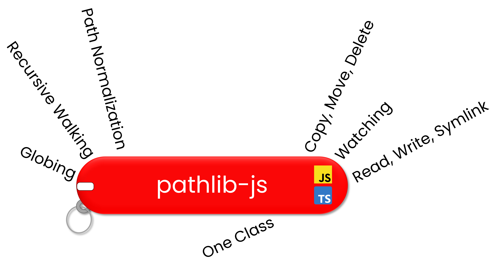
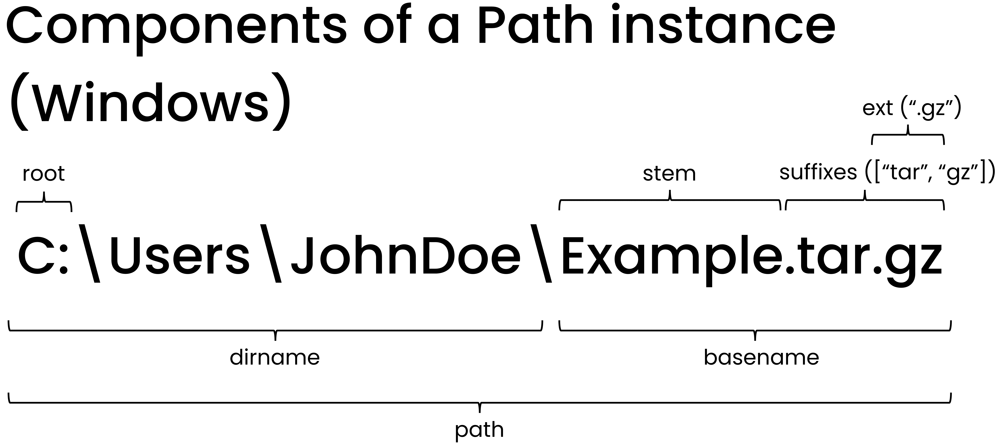
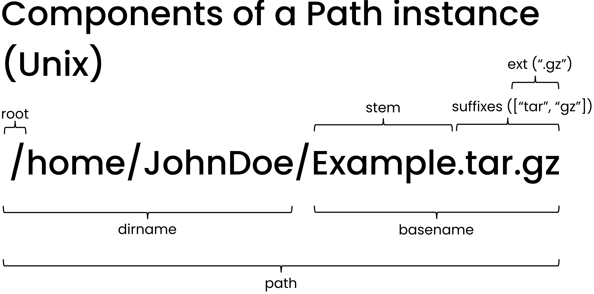

<p align="center">
  <a href="" rel="noopener">
 </a>
</p>

---

<h3 align="center"> Object-oriented Filepath Operations in Javascript & Typescript
</h3>

<div align="left">

[]()
[](https://github.com/MauricePasternak/pathlib-js/issues)
[](https://github.com/MauricePasternak/pathlib-js/pulls)
[](/LICENSE)

</div>

## 📝 Table of Contents

- <a href = "#whypathlib">Why pathlib-js</a>
- <a href = "#usage">Usage & API Links</a>
- <a href = "#wrappers">The Wonderful Libraries that this wraps around</a>
- <a href = "#testing">Testing</a>
- <a href = "#authors">Authors</a>
- <a href = "#acknowledgements">Acknowledgments</a>

## 🤔 Why pathlib-js? <a id = "whypathlib"></a>

If you're coming from Python, think of it this way: this library is to NodeJS's `fs` and `path` modules as Python's `pathlib` is to its own `os` module.

Avoids the hassle of string preprocessing, filepath normalization, and passing filepaths between the multitude of functions found in nodeJS `filesystem` and `path` modules.

A single class `Path` wraps around a filepath and exposes an API for accessing its components, globbing, watching, reading, writing, traversing a tree structure, etc.

This is not the first package to take an OOP approach to filepaths in Javascript, but hopes to be more feature-rich than others from 5-6 years ago.

### Prerequisites

NodeJS v12 or greater

### Installing

You know the drill

```
npm i pathlib-js
```

or

```
yarn add pathlib-js
```

## 🛠️ Usage & API Links <a id = "usage"></a>

### Understanding parts of a Path

`Path` instances carry properties that tie in with the typically-used components of a filepath.

For example, if a particular Path instance was located in a variable `example` and you wished to retrieve the basename of the underlying filepath, you can simply access it by `example.basename`.

<p align="center">
  <a href="" rel="noopener">
 </a>
</p>
<p align="center">
  <a href="" rel="noopener">
 </a>
</p>

### Defining a path

Paths can be defined from a single string or multiple strings which are resolved into a single path.

```
import Path from "pathlib-js"
const fp1 = new Path("/home/Documents/Yougetthepoint.json");
const fp2 = new Path("/", "home/watch_this_disappear", "../Documents/Yougetthepoint.json");
console.log(fp1.path === fp2.path);

> true
```

### More concrete usages & API

- [Manipulating filepath strings](https://github.com/MauricePasternak/pathlib-js/blob/master/docs/Filepath_String_Manipulation.md)
- [Determinine filepath type, stats, existence.](https://github.com/MauricePasternak/pathlib-js/blob/master/docs/Filepath_Integrity-Stats-Type.md)
- [File Structure Traversal - Individual Directories](https://github.com/MauricePasternak/pathlib-js/blob/master/docs/Traversing_Directories.md)
- [File Structure Traversal - Tree Structures](https://github.com/MauricePasternak/pathlib-js/blob/master/docs/Traversing_Trees.md)
- [Copying, moving, deleting, and changing permissions](https://github.com/MauricePasternak/pathlib-js/blob/master/docs/Filepath-Parent-Type-Stats-Permissions.md)
- [Filepath Creation - Directories, Files, and Symlinks](https://github.com/MauricePasternak/pathlib-js/blob/master/docs/Generating-Filepaths.md)
- [Reading, Writing, Globbing, and Watching](https://github.com/MauricePasternak/pathlib-js/blob/master/docs/Read-Write-Glob-Watch.md)

## 🧪 Testing <a id = "testing"></a>

This library is regularly updating its test suite with additional case scenarios.

At the current time, please anticipate the following conditional test failures:

- On Windows, `makeSymlink()` and `makeSymlinkSync()` methods will fail if the environment they are used in lacks administrator priveleges (i.e. testing in VScode without starting it up with admin priveleges). This caveat has not been seen on Unix-based systems.

## 🥇 The Wonderful Libraries that this wraps around <a id = "wrappers"></a>

This wouldn't be possible without these awesome libraries. Give them a star.

- [node-fs-extra](https://github.com/jprichardson/node-fs-extra) - Enhanced filesystem operations.
- [chokidar](https://github.com/paulmillr/chokidar) - Robust and efficient filesystem watching.
- [fast-glob](https://github.com/mrmlnc/fast-glob) - Robust and fast globbing potential.
- [path-normalize](https://nodejs.org/en/) - Workhorse function for robustly normalizing filepaths

## ✍️ Authors <a id = "authors"></a>

- [@MauricePasternak](https://github.com/MauricePasternak)

## 🎉 Acknowledgements <a id = "acknowledgements"></a>

A thank you to the individuals who actually read README file from start to finish.
